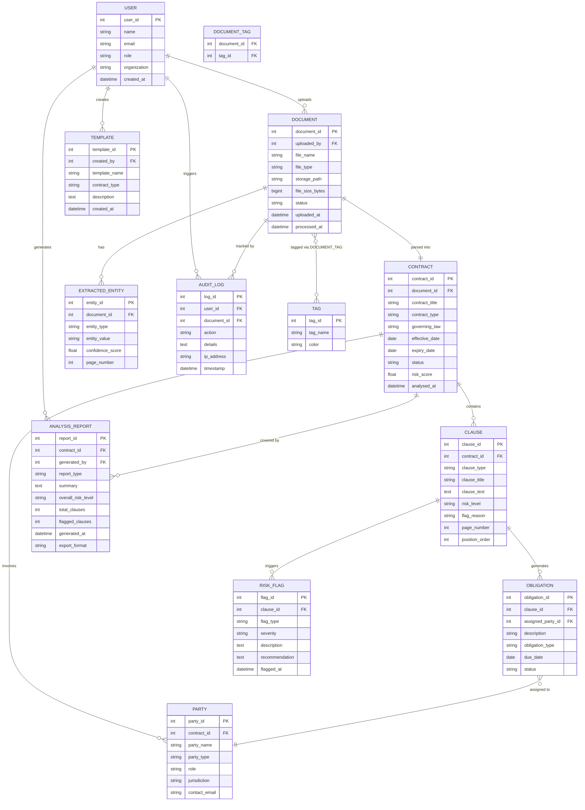

# ER Diagram – Intelligent Document Processing & Contract Analyser

```mermaid
erDiagram

    USER {
        int user_id PK
        string name
        string email
        string role
        string organization
        datetime created_at
    }

    DOCUMENT {
        int document_id PK
        int uploaded_by FK
        string file_name
        string file_type
        string storage_path
        bigint file_size_bytes
        string status
        datetime uploaded_at
        datetime processed_at
    }

    CONTRACT {
        int contract_id PK
        int document_id FK
        string contract_title
        string contract_type
        string governing_law
        date effective_date
        date expiry_date
        string status
        float risk_score
        datetime analysed_at
    }

    PARTY {
        int party_id PK
        int contract_id FK
        string party_name
        string party_type
        string role
        string jurisdiction
        string contact_email
    }

    CLAUSE {
        int clause_id PK
        int contract_id FK
        string clause_type
        string clause_title
        text clause_text
        string risk_level
        string flag_reason
        int page_number
        int position_order
    }

    OBLIGATION {
        int obligation_id PK
        int clause_id FK
        int assigned_party_id FK
        string description
        string obligation_type
        date due_date
        string status
    }

    EXTRACTED_ENTITY {
        int entity_id PK
        int document_id FK
        string entity_type
        string entity_value
        float confidence_score
        int page_number
    }

    ANALYSIS_REPORT {
        int report_id PK
        int contract_id FK
        int generated_by FK
        string report_type
        text summary
        string overall_risk_level
        int total_clauses
        int flagged_clauses
        datetime generated_at
        string export_format
    }

    RISK_FLAG {
        int flag_id PK
        int clause_id FK
        string flag_type
        string severity
        text description
        text recommendation
        datetime flagged_at
    }

    AUDIT_LOG {
        int log_id PK
        int user_id FK
        int document_id FK
        string action
        text details
        string ip_address
        datetime timestamp
    }

    TAG {
        int tag_id PK
        string tag_name
        string color
    }

    DOCUMENT_TAG {
        int document_id FK
        int tag_id FK
    }

    TEMPLATE {
        int template_id PK
        int created_by FK
        string template_name
        string contract_type
        text description
        datetime created_at
    }

    %% Relationships
    USER ||--o{ DOCUMENT         : "uploads"
    USER ||--o{ ANALYSIS_REPORT  : "generates"
    USER ||--o{ AUDIT_LOG        : "triggers"
    USER ||--o{ TEMPLATE         : "creates"

    DOCUMENT ||--|| CONTRACT      : "parsed into"
    DOCUMENT ||--o{ EXTRACTED_ENTITY : "has"
    DOCUMENT ||--o{ AUDIT_LOG    : "tracked by"
    DOCUMENT }o--o{ TAG          : "tagged via DOCUMENT_TAG"

    CONTRACT ||--o{ PARTY        : "involves"
    CONTRACT ||--o{ CLAUSE       : "contains"
    CONTRACT ||--o{ ANALYSIS_REPORT : "covered by"

    CLAUSE ||--o{ OBLIGATION     : "generates"
    CLAUSE ||--o{ RISK_FLAG      : "triggers"

    OBLIGATION }o--|| PARTY      : "assigned to"
```
