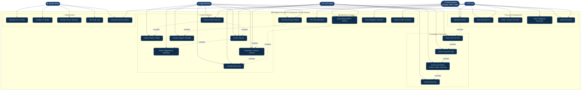

# Use Case Diagram – Intelligent Document Processing & Contract Analyser

```mermaid
graph TB
    %% ── Actors ──────────────────────────────────────────────
    EndUser(["👤 End User"])
    LegalReviewer(["⚖️ Legal Reviewer"])
    Admin(["🛠️ System Admin"])
    AIEngine(["🤖 AI / NLP Engine"])
    ExtSystem(["🔗 External System\n(Storage / ERP / CRM)"])

    %% ── System Boundary ──────────────────────────────────────
    subgraph IDPCA ["🗂️ Intelligent Document Processing & Contract Analyser"]

        subgraph DOC_MGMT ["📁 Document Management"]
            UC1["Upload Document"]
            UC2["View Document List"]
            UC3["Delete / Archive Document"]
            UC4["Tag & Categorise Document"]
            UC5["Export Document"]
        end

        subgraph PROCESSING ["⚙️ Intelligent Processing"]
            UC6["Extract Text via OCR"]
            UC7["Detect Document Type"]
            UC8["Extract Key Entities\n(Dates, Names, Amounts)"]
            UC9["Classify Document"]
        end

        subgraph CONTRACT_ANALYSIS ["📜 Contract Analysis"]
            UC10["Parse Contract Structure"]
            UC11["Identify Parties & Roles"]
            UC12["Extract Clauses"]
            UC13["Detect Obligations & Deadlines"]
            UC14["Flag Risky / Unusual Clauses"]
            UC15["Calculate Risk Score"]
            UC16["Compare Against Template"]
        end

        subgraph REPORTING ["📊 Reporting & Insights"]
            UC17["Generate Analysis Report"]
            UC18["View Risk Dashboard"]
            UC19["Export Report (PDF / DOCX)"]
            UC20["Track Obligation Deadlines"]
            UC21["Search & Filter Contracts"]
        end

        subgraph ADMIN_OPS ["🔧 Administration"]
            UC22["Manage Users & Roles"]
            UC23["Configure AI Models"]
            UC24["Manage Clause Templates"]
            UC25["View Audit Logs"]
            UC26["Integrate External Systems"]
        end

    end

    %% ── End User interactions ────────────────────────────────
    EndUser --> UC1
    EndUser --> UC2
    EndUser --> UC3
    EndUser --> UC4
    EndUser --> UC5
    EndUser --> UC17
    EndUser --> UC18
    EndUser --> UC19
    EndUser --> UC20
    EndUser --> UC21

    %% ── Legal Reviewer interactions ──────────────────────────
    LegalReviewer --> UC2
    LegalReviewer --> UC10
    LegalReviewer --> UC11
    LegalReviewer --> UC12
    LegalReviewer --> UC13
    LegalReviewer --> UC14
    LegalReviewer --> UC15
    LegalReviewer --> UC16
    LegalReviewer --> UC17
    LegalReviewer --> UC19

    %% ── AI Engine interactions ───────────────────────────────
    AIEngine --> UC6
    AIEngine --> UC7
    AIEngine --> UC8
    AIEngine --> UC9
    AIEngine --> UC10
    AIEngine --> UC12
    AIEngine --> UC14
    AIEngine --> UC15

    %% ── Admin interactions ───────────────────────────────────
    Admin --> UC22
    Admin --> UC23
    Admin --> UC24
    Admin --> UC25
    Admin --> UC26

    %% ── External System interactions ─────────────────────────
    ExtSystem --> UC1
    ExtSystem --> UC5
    ExtSystem --> UC26

    %% ── Include / Extend relationships ───────────────────────
    UC1  -. "«include»" .-> UC6
    UC6  -. "«include»" .-> UC7
    UC7  -. "«include»" .-> UC8
    UC8  -. "«include»" .-> UC9
    UC10 -. "«include»" .-> UC11
    UC10 -. "«include»" .-> UC12
    UC12 -. "«include»" .-> UC13
    UC12 -. "«extend»"  .-> UC14
    UC14 -. "«include»" .-> UC15
    UC17 -. "«include»" .-> UC15
    UC17 -. "«extend»"  .-> UC16

    %% ── Styling ──────────────────────────────────────────────
    classDef actor    fill:#1e3a5f,stroke:#4a9eff,color:#ffffff,rx:50
    classDef usecase  fill:#0f2d4a,stroke:#2e7bbf,color:#cce4ff,rx:8
    classDef subg     fill:#071828,stroke:#1a4a70

    class EndUser,LegalReviewer,Admin,AIEngine,ExtSystem actor
    class UC1,UC2,UC3,UC4,UC5,UC6,UC7,UC8,UC9,UC10,UC11,UC12,UC13,UC14,UC15,UC16,UC17,UC18,UC19,UC20,UC21,UC22,UC23,UC24,UC25,UC26 usecase
```
